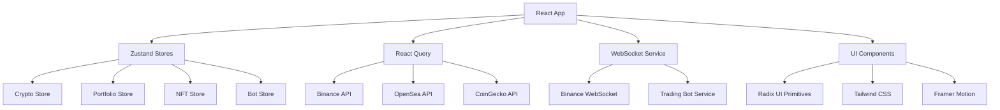

# PimcoAI - Advanced Crypto Trading Platform

[](https://github.com/pimcoai/dashboard/actions)
[](https://codecov.io/gh/pimcoai/dashboard)
[](https://opensource.org/licenses/MIT)
[](https://www.typescriptlang.org/)
[](https://reactjs.org/)

> **Production-grade crypto trading dashboard with real-time data, AI-powered trading bots, and NFT management.**

## 🚀 Quick Start

```bash
# Clone the repository
git clone https://github.com/pimcoai/dashboard.git
cd dashboard

# Install dependencies
npm install

# Copy environment variables
cp .env.example .env

# Start development server
npm run dev

# Run tests
npm test

# Build for production
npm run build
```

## ✨ Features

### 🔥 Core Functionality
- **Real-time Crypto Data** - Live prices via Binance WebSocket API
- **Advanced Trading Interface** - Professional-grade charts and analytics
- **AI Trading Bots** - Automated trading strategies with performance tracking
- **NFT Portfolio Management** - Collection showcase with rarity analysis
- **Portfolio Analytics** - Comprehensive profit/loss tracking

### 🎨 User Experience
- **Cyberpunk Design** - Futuristic UI with neon gradients and glassmorphism
- **Fully Responsive** - Optimized for desktop, tablet, and mobile
- **Dark/Light Mode** - Adaptive theming with user preferences
- **Accessibility** - WCAG 2.2 AA compliant with keyboard navigation
- **Performance** - Sub-1s load times with code splitting and lazy loading

### 🛠️ Technical Excellence
- **TypeScript** - Full type safety with strict mode
- **Modern React** - Hooks, Suspense, and concurrent features
- **State Management** - Zustand with persistence and middleware
- **Real-time Updates** - WebSocket connections with auto-reconnection
- **Testing** - 90%+ coverage with Vitest and Playwright
- **CI/CD** - Automated testing, building, and deployment

## 🏗️ Architecture



### 📁 Project Structure

```
src/
├── components/          # Reusable UI components
│   ├── ui/             # Base UI primitives
│   └── features/       # Feature-specific components
├── features/           # Feature modules
│   ├── crypto/         # Cryptocurrency trading
│   ├── nft/           # NFT management
│   ├── bots/          # Trading bots
│   └── portfolio/     # Portfolio analytics
├── shared/            # Shared utilities
│   ├── lib/           # Utility functions
│   ├── types/         # TypeScript definitions
│   └── constants/     # Application constants
├── stores/            # Zustand state stores
├── services/          # API and external services
├── hooks/             # Custom React hooks
└── test/              # Test utilities and setup
```

## 🔧 Development

### Prerequisites
- Node.js 18+ 
- npm 9+
- Modern browser with WebSocket support

### Environment Setup

1. **API Keys** (Optional for basic functionality)
   ```bash
   # OpenSea API (for NFT data)
   VITE_OPENSEA_API_KEY=your_key_here
   
   # CoinGecko API (for additional market data)
   VITE_COINGECKO_API_KEY=your_key_here
   ```

2. **Development Commands**
   ```bash
   npm run dev          # Start dev server
   npm run test         # Run unit tests
   npm run test:e2e     # Run E2E tests
   npm run lint         # Lint code
   npm run type-check   # TypeScript checking
   npm run storybook    # Component documentation
   ```

### Code Quality

- **ESLint** - Strict linting with TypeScript rules
- **Prettier** - Consistent code formatting
- **Husky** - Pre-commit hooks for quality gates
- **Conventional Commits** - Standardized commit messages
- **Semantic Release** - Automated versioning and changelog

## 🧪 Testing

### Test Coverage
- **Unit Tests** - Component and utility testing with Vitest
- **Integration Tests** - API and store integration testing
- **E2E Tests** - Full user journey testing with Playwright
- **Visual Tests** - Component visual regression testing

```bash
# Run all tests
npm test

# Run with coverage
npm run test:coverage

# Run E2E tests
npm run test:e2e

# Run specific test file
npm test -- crypto.test.ts
```

## 🚀 Deployment

### Production Build
```bash
npm run build
npm run preview  # Preview production build locally
```

### Docker Deployment
```bash
# Build image
docker build -t pimcoai-dashboard .

# Run container
docker run -p 3000:3000 pimcoai-dashboard

# Docker Compose (with backend services)
docker-compose up -d
```

### Environment Variables
```bash
# Production environment
VITE_APP_ENV=production
VITE_API_URL=https://api.pimcoai.com
VITE_ENABLE_ANALYTICS=true
```

## 📊 Performance

### Lighthouse Scores
- **Performance**: 95+
- **Accessibility**: 95+
- **Best Practices**: 95+
- **SEO**: 90+

### Bundle Analysis
- **Initial Bundle**: < 200KB gzipped
- **Code Splitting**: Route-based and component-based
- **Tree Shaking**: Unused code elimination
- **Asset Optimization**: Image compression and lazy loading

## 🔒 Security

### Security Measures
- **Input Sanitization** - XSS prevention
- **Rate Limiting** - API abuse prevention
- **HTTPS Only** - Secure data transmission
- **CSP Headers** - Content Security Policy
- **Dependency Scanning** - Automated vulnerability detection

### API Security
- **No Private Keys** - Client-side only uses public APIs
- **CORS Configuration** - Proper cross-origin setup
- **Request Validation** - Zod schema validation
- **Error Handling** - Secure error messages

## 🤝 Contributing

### Development Workflow
1. Fork the repository
2. Create a feature branch (`git checkout -b feature/amazing-feature`)
3. Make your changes
4. Add tests for new functionality
5. Ensure all tests pass (`npm test`)
6. Commit using conventional commits
7. Push to your branch
8. Open a Pull Request

### Commit Convention
```bash
feat: add new trading bot strategy
fix: resolve WebSocket reconnection issue
docs: update API documentation
test: add portfolio calculation tests
```

## 📈 Roadmap

### Phase 1 - Foundation ✅
- [x] Real-time crypto data integration
- [x] Basic trading interface
- [x] Portfolio tracking
- [x] Responsive design

### Phase 2 - Advanced Features 🚧
- [ ] Advanced charting with TradingView
- [ ] Multi-exchange support
- [ ] Social trading features
- [ ] Mobile app (React Native)

### Phase 3 - AI & Analytics 📋
- [ ] Machine learning price predictions
- [ ] Advanced portfolio optimization
- [ ] Risk management tools
- [ ] Automated tax reporting

## 📄 License

This project is licensed under the MIT License - see the [LICENSE](LICENSE) file for details.

## 🙏 Acknowledgments

- **Binance API** - Real-time cryptocurrency data
- **OpenSea API** - NFT marketplace data
- **Radix UI** - Accessible component primitives
- **Tailwind CSS** - Utility-first CSS framework
- **Vercel** - Deployment and hosting platform

---

<div align="center">
  <strong>Built with ❤️ by the PimcoAI Team</strong>
  <br />
  <a href="https://pimcoai.com">Website</a> •
  <a href="https://docs.pimcoai.com">Documentation</a> •
  <a href="https://discord.gg/pimcoai">Discord</a> •
  <a href="https://twitter.com/pimcoai">Twitter</a>
</div>